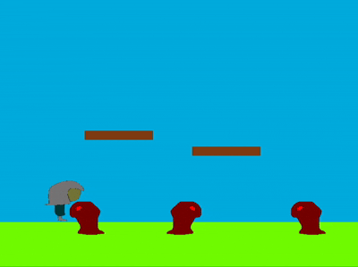

# EasyPyEngine
[](./LICENSE) 

EasyPyEngine is a beginner-friendly 2D game engine for Python, written in C using SDL2.  
It provides a built-in game loop, simple asset loading, and basic rendering utilities for rapid prototyping and learning game development.

## 🚀 Features

- 🎮 Built-in game loop
- 🕹 Keyboard input handling
- 📦 Sprite system (images and rectangles)
- ✔️ Delta-time support for smooth movement
- ⚙️ Simple and readable Python API

## 📸 Screenshot & Demo
   
👉 The [Game](https://github.com/Jean1000levrai/Stealth-Game)

## 🧪 Quick Example (Python)
```python
import easyPyEngine as epe

engine = epe.Engine("My Game", 800, 600)

sprite = epe.Sprite()
sprite.add_image(engine, "path/to/image.png", 100, 100)

sp2 = epe.Sprite()
sp2.add_rect(100, 100, (255, 0, 0), 1)

x = 100
y = 400
speed = 200

def update(dt):
    global x, y

    engine.clear(color=(135, 206, 235))
    engine.draw_rect(0, 500, 800, 600, (124, 252, 0), 1)

    sp2.draw(engine, 100, 400)
    sprite.draw(engine, x, y)

    if engine.is_key_pressed("w"):
        sprite.height += 2
    if engine.is_key_pressed("s"):
        sprite.height -= 2
    if engine.is_key_pressed("a"):
        x -= speed * dt
    if engine.is_key_pressed("d"):
        x += speed * dt

engine.run(update)
engine.quit()

```

## 📘 Documentation

Explore the guides below to begin using the engine:   
- [Getting Started](docs/getting_started.md) – Setup, build and install basics
- [Usage](docs/usage.md) – API reference and example code


## ⚙️ Installation
Check out this part of the documentation:
[Getting Started](docs/getting_started.md)

## 🧠 Motivation

EasyPyEngine was developed as part of the Moonshot Hack Club event.   
It’s designed to introduce Python developers to game engine fundamentals without overwhelming complexity.

## 🧩 Contributing

Contributions are welcome. See CONTRIBUTING.md for guidelines on reporting bugs, proposing features, and submitting pull requests.  
Before contributing, please ensure you follow the code style and documentation standards.

## 🤝 Contributors

[](https://github.com/Jean1000levrai/EasyPyEngine/graphs/contributors)


## 📄 License

This project is licensed under the MIT License — see [LICENSE](LICENSE) for more details. 


